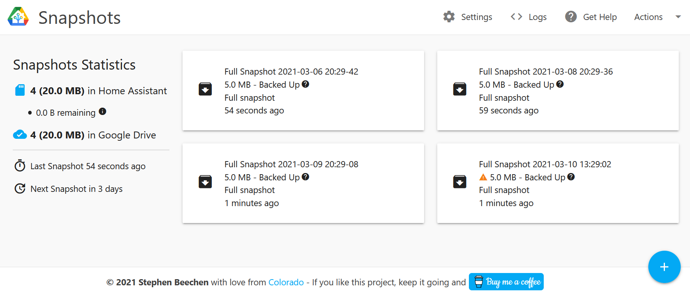
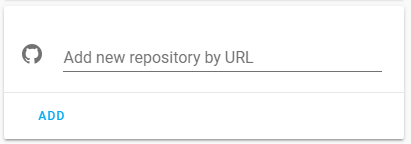
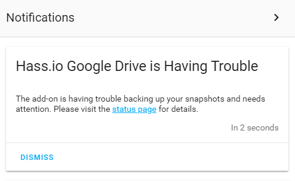

# Hass.io Google Drive Backup

## About
A complete and easy to configure solution for backing up your snapshots to Google Drive
* Automatically creates new snapshots on a configurable schedule.
* Uploads any snapshots it finds to Google Drive.
* Automatically cleans up old snapshots in Home Assistant and Google drive so you don't run out of space.
* Integrates with Home Assistant Notifications, and provides sensors you can trigger off of.

This is for you if you want to quickly set up a backup strategy without having to do much work.

Particularly, most of the existing solutions for back I've found for Hass.io:
* Provide no mechanism for taking action when they fail
* Provide no mechanism for seeing what they're actually doing
* Don't come with an easy way to clean up old snapshots
* Require truly <i>arcane</i> knowledge of of the Google Drive, Hass.io or Dropbox API 

I made this to avoid these complications.  Install the add-on, click the button that authenticates with Google Drive, and you're backed up from then on.   If you don't have a Google account already, its pretty easy to [create one](https://www.google.com/intl/en/drive/) and Google gives you 15GB of free storage (at the time of writing), which should be enough for as many backups as you want. 

## Installation
The add-on is installed like any other.
1.   Go to you Hass.io > "Add-on" page in Home Assistant and add this repository: [https://github.com/sabeechen/hassio-google-drive-backup](https://github.com/sabeechen/hassio-google-drive-backup)
  
     
2.   Scroll down the page to find the new repository, and click the new add-on named "Hass.io Google Drive Backup"

     
3.   Click "Install" and give it a few minutes to finish downloading.
4.   Take note of the default configuration options.  For most people the default settings are sufficient:
     *   **max_snapshots_in_hassio**: is the number of snapshots the add-on will allow Hass.io to store locally before old ones are deleted.  
     *   **max_snapshots_in_google_drive**: is the number of snapshots the add-on will keep in Google Drive before old ones are deleted.
     *   **days_between_snapshots**: How often a new snapshot should be scheduled, eg "1" for daily and "7" for weekly.
     *   **use_ssl**: determines if the add-on's webpage should only expose its interface over ssl.  If you use the [Duck DNS Add-on](https://www.home-assistant.io/addons/duckdns/) with the default settings then `"use_ssl": true`setting this to true should just work, if not [see below](#configuration-options).
     
     Other less common config options are explained [below](#configuration-options).
     > Be aware that once you start the Add-on, it will start cleaning up old snapshots immediately.  If you have 5 snapshots and you start the add-on with **max_snapshots_in_hassio**=4 then the oldest one will get deleted.
5.   Click "Start", give it a few seconds to spin up, and then click the "Open Web UI" button that appears.  For the majority of users this should take you to [https://hassio.local:1627/](https://hassio.local:1627/).
6.   Log in to the webpage with your Home Assistant username and password.
6.   Follow the instruction on-screen to link the Add-on with your Google Drive account.  Two methods of doing this are provided, since authenticating with Google's servers can be tempermental while this Add-on is still under development.
7.   You should be redirected automatically to the backup status page.  Here you can make a new snapshot, see the progress of uploading to Google Drive, etc.  You're done!

## Configuration Options
I addition to the options described in the instructions above:
*   **verbose** (default: false): If true, enable additional debug logging.  Useful if you start seeing errors and need to file a bug with me.
*   **certfile** (default: /ssl/certfile.pem): The path to your ssl keyfile
*   **keyfile** (default: /ssl/keyfile.pem): the path to your ssl certfile
*   **require_login** (default: true): When true, requires your home assistant username and password to access the backpup status page.  Turning this off isn't recommended.
*   **snapshot_stale_minutes** (default: 180):  How long to wait after a snapshot should have been created to consider snapshots stale and in need of attention.  Setting this too low can cause you to be notified of transient errors, ie the internet being down briefly.
*  **hours_before_snapshot** (default: 1):  How logn the add-on shoudl wait after startup before scheduling a new snapshot, if one is scheduled.  Prevents the add-on from scheduling a snapshot if one was created recently and the add-on was restarted. 

## FAQ
### How will I know this will be there when I need it?
Home Assistant is notorious for failing silently, and your backups aren't something you want to find is broken after an erroneous comma makes you unable to turn on any of the lights in your house.  Thats why I've added some functionality to keep you informed if things start to break.  If the add-on runs into trouble and gets more than 12 hours behind its schedule, you'll know in two ways:
* Notifications in Home Assistant UI

  

* A [binary_sensor](#configuration-options) you can use to trigger additional actions.
  
   

Redundancy is the foundation of reliability.  With local snapshots, Google Drive's backups, and two flavors of notification I think you're covered.

### I never look at HA notifications.  Can I show information about backups in my Home Assistant Interface?
The add-on creates a few sensors that show the status of snapshots that you could trigger automations off of.  `binary_sensor.snapshots_stale` becomes true when the add-on has trouble backing up or creating snapshots.  For example the lovelace card below only shows up in the UI when snapshots go stale:
#### Lovelace Card

    type: conditional
    conditions:
      - entity: binary_sensor.snapshots_stale
        state_not: 'False'
    card:
      type: markdown
      content: >-
        Snapshots are stale! Please visit the "Hass.io Google Drive Backup" add-on
        status page for details.
      title: Stale Snapshots!`
#### Mobile Notifications
If you have [android](https://github.com/Crewski/HANotify) or [iOS](https://www.home-assistant.io/docs/ecosystem/ios/), [other notifications](https://www.home-assistant.io/components/notify/) set up, this automation would let you know if things go stale:

    - alias: Snapshots went stale
      id: 'snapshots_went_stale'
      trigger:
      - platform: state
        entity_id: binary_sensor.snapshots_stale
        from: 'False'
        to: 'True'
      condition: []
      action:
      - data:
        service: notify.android
          title: Snapshots are Stale
          message: Please visit the 'Hass.io Google Drive Backup ' add-on status page
            for details.

You could automate anything off of this binary sensor.  The add-on also exposes a sensor `snapshot_backup.state` that exposes the details of each snapshot.  I'm working on a custom lovelace component to expose that information.

### Can I permanently save a snapshot so it doesn't get cleaned up?
The Add-on will only ever look at snapshots in the folder in Google Drive it created.  If you move the snapshots anywhere else in Google Drive, they will be ignored.  Just don't move them back in accidentally since they'll get "cleaned up" like any old snapshot after a while :)

### I already have something that backs up my snapshots.  Can I just use this to trigger new ones?
Yes, though I'll point out that Google Gives you a lot of free storage, 15GB at the time of this writing, and their infrastructure is a lot more resiliant than any of your hard drives.  If you set the configuration option:
`"max_snapshots_in_google_drive": 0`
Then it won't try to upload anything to Google Drive.

### I installed the add-on but, I don't have any snapshots, and it doesn't look like its making any.  What gives?
The add-on prevents itself from making any new **automatic** snapshots for an hour after its first starts up.  This is to prevent it from requesting a snapshot while Hass.io is already be making one.  You can still ask it to make one manuall by pressing the "New Snapshot" button on the status web UI, or you can just be patient for crying out loud.

### What do I do if I've found an error?
If the add-on runs into trouble and can't back up, you should see a big red box with the text of the error on the status webpage.  This should include a link to pre-populate a new issue in github, which I'd encourage you to do.  Additioanlly you can set the add-on config option `"verbose" : true` to get information from the add-on's logs to help me with debugging.

### Will this fill up my Google Drive?  Why are my snapshots so big?
You'll need tot take care to ensure you don't configure this to blow up your Google Drive.  You might want to consider:
*   If your snapshots are HUGE, its probably because Home Assistant by defaults keeps 10 days of sensor history.  Consider setting `purge_keep_days: N` in your [recorder confiuration](https://www.home-assistant.io/components/recorder/) to trim it down to something more manageable, like 1 day of history.
*   If you use the Google Drive Desktop sync client, you'll porbably want to tell it not to sync this folder (its available in the options).

### I want my snapshots to sync to my Desktop computer too
Thats not a question but you can use [Google Drive Backup & Sync]([https://www.google.com/drive/download/) to download anything in your Google Drive to your desktop computer.

### I configured this to only keep 4 snapshots in Drive and Hass.io, but sometimes I can see there are 5?
The add-on will only delete an old snapshot if a new one exists to replace it, so it will create a 5th one before deleting the first.  This is a reliability/disk usage compromise that favors reliability, because otherwise it would have to delete an old snapshot (leaving only 3) before it could guarantee the 4th one actually exists.

